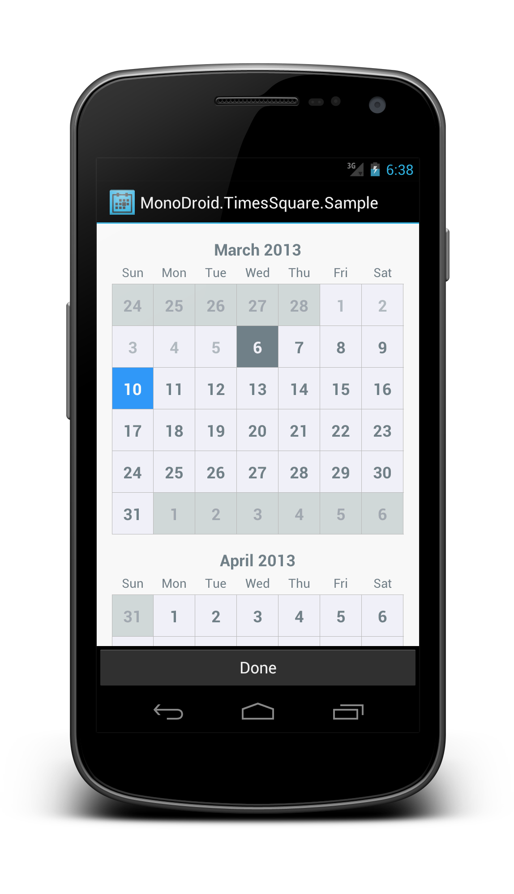

MonoDroid.TimesSquare
=====================

A port of [android-times-square](https://github.com/square/android-times-square).

Standalone Android widget for picking a single date from a calendar view.



Usage
-----

Include `CalendarPickerView` in your layout xml.

```xml
<monodroid.timessquare.CalendarPickerView
    android:id="@+id/calendar_view"
    android:layout_width="match_parent"
    android:layout_height="match_parent"
    />
```

This is a fairly large control so it is wise to give it ample space in your layout. On small devices it is recommended to use a dialog, full-screen fragment, or dedicated activity. On larger devices like tablets, displaying full-screen is not recommended. A fragment occupying part of the layout or a dialog is a better choice.

In the `OnCreate` of your activity/dialog or the `OnCreateView` of your fragment, initialize the view with a range of valid dates as well as the currently selected date.

```c#
...

var nextYear = DateTime.Now.AddYears(1);

var calendar = FindViewById<CalendarPickerView> (Resource.Id.calendar_view);
calendar.Init (DateTime.Now, DateTime.Now, nextYear);

```

To retrieve the currently selected date, call `calendar.SelectedDate` on the view.

Implementation Details
----------------------

The idea of original [android-times-square](https://github.com/square/android-times-square) could be found [here](http://corner.squareup.com/2013/01/times-square.html).

>For Android, we use the standard Java Calendar class to do our date calculations. We considered using a third-party date library but decided to keep our library’s footprint as small as possible. As for the layout, we wrote a custom ListView: each row represents one month. Each MonthView uses custom measurement and layout logic for optimal scrolling speed.

Download
--------

The latest version can be downloade in [zip][zip] and referenced by your application as a library project.


License
-------

    Copyright 2012 Square, Inc.
    
    Original work: (https://github.com/square/android-times-square).
    
    Ported to Mono for Android.
    
    Copyright (C) 2013 Aaron He <aaron.wei.he@gmail.com>

    Licensed under the Apache License, Version 2.0 (the "License");
    you may not use this file except in compliance with the License.
    You may obtain a copy of the License at

       http://www.apache.org/licenses/LICENSE-2.0

    Unless required by applicable law or agreed to in writing, software
    distributed under the License is distributed on an "AS IS" BASIS,
    WITHOUT WARRANTIES OR CONDITIONS OF ANY KIND, either express or implied.
    See the License for the specific language governing permissions and
    limitations under the License.
    
    
[zip]: https://github.com/aaronmix/MonoDroid.TimesSquare/archive/master.zip
