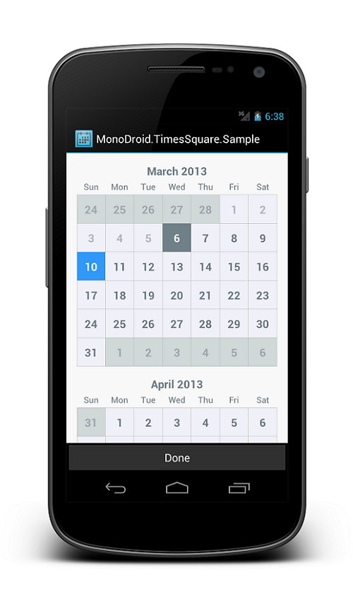

MonoDroid.TimesSquare
=====================

MonoDroid.TimesSquare is a standalone Android widget for picking a single date from a calendar view.

It supports picking a single date, a range of dates and multiple dates.



Usage
-----

Include `CalendarPickerView` in your layout xml.

```xml
<monodroid.timessquare.CalendarPickerView
    android:id="@+id/calendar_view"
    android:layout_width="match_parent"
    android:layout_height="match_parent"
    />
```

This is a fairly large control so it is wise to give it ample space in your layout. On small devices it is recommended to use a dialog, full-screen fragment, or dedicated activity. On larger devices like tablets, displaying full-screen is not recommended. A fragment occupying part of the layout or a dialog is a better choice.

In the `OnCreate` of your activity/dialog or the `OnCreateView` of your fragment, initialize the view with a range of valid dates as well as the currently selected date.

```c#
...

var nextYear = DateTime.Now.AddYears(1);

var calendar = FindViewById<CalendarPickerView> (Resource.Id.calendar_view);
calendar.Init (DateTime.Now, nextYear)
    .WithSelectedDate(DateTime.Now);
```

The default mode of the view is to have one selectable date.  If you want the user to be able to
select multiple dates or a date range, use the InMode() method:

```c#

calendar.Init (DateTime.Now, nextYear)
    .InMode(CalendarPickerView.SelectionMode.Range);
```

To retrieve the currently selected date, call `calendar.SelectedDate` on the view.